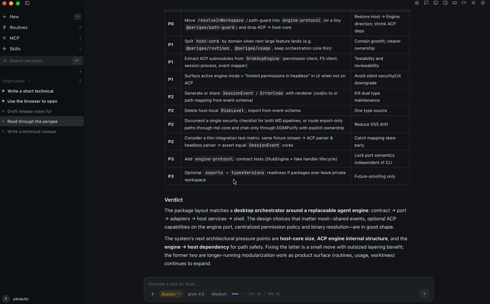
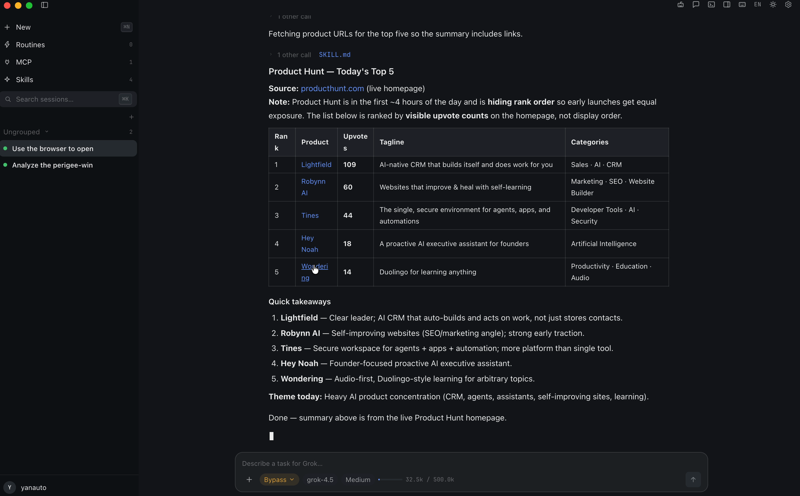
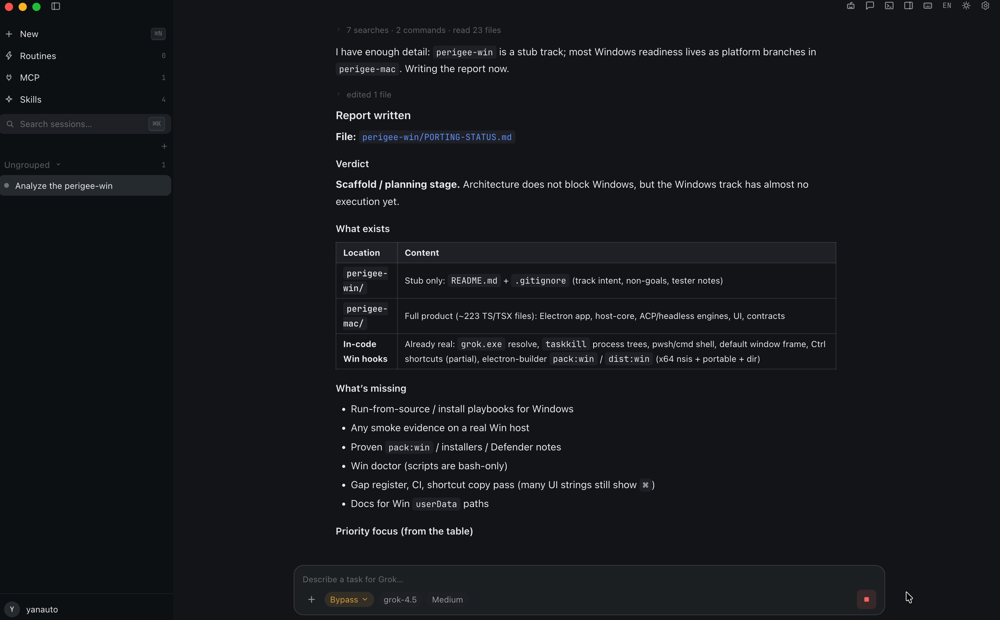
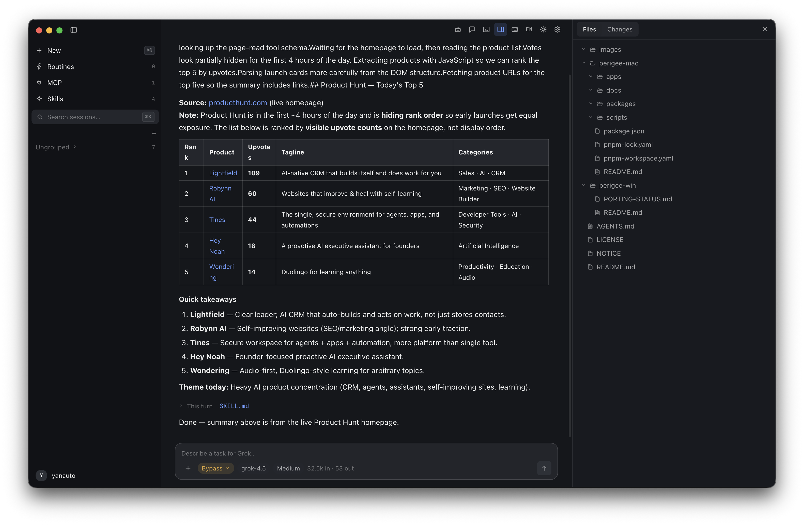

<div align="center">


# Perigee

A macOS desktop for running Grok agents — multiple sessions in one window, built-in browser control, live markdown rendering.

[English](#english) · [简体中文](README.zh-CN.md) · [Website](https://perigee.yan-auto.me) · [@yanautome](https://x.com/yanautome)



<a href="https://youtu.be/Y_iETgHcjTA"></a>

🎬 **[Watch the 2-minute demo on YouTube](https://youtu.be/Y_iETgHcjTA)**

</div>

---

## English

### Status

| Platform | State |
|---|---|
| **macOS** | ✅ **Ready** — daily-driven by the team |
| **Windows** | 🚧 In progress — porting & testing |

### What it does

- **Multiple sessions** — run several agent sessions side by side. The sidebar shows what each one is doing; switch between them anytime.
- **Browser control, built in** — agents drive Chrome through Flyby (an MCP tool): open pages, read content, operate the web. Every step is visible and permission-gated.
- **Live markdown** — agents write documents constantly; Perigee renders them as they're being written. Finished documents open in a built-in reader panel.

<div align="center">



*An agent used Flyby to read the live Product Hunt homepage, then wrote this summary.*



*A status report, rendered as the agent writes it.*



*Finished documents open in the built-in reader panel, next to the conversation.*

</div>

### Quick start (macOS)

```bash
git clone https://github.com/yanauto/perigee.git
cd perigee/perigee-mac
pnpm install
pnpm dev
```

**Requirements**: Node ≥ 20 · pnpm · the official Grok Build CLI installed locally (Stub mode lets you try the UI without it).

Packaged .dmg releases are coming — watch the [Releases](https://github.com/yanauto/perigee/releases) page.

### Project layout

| Dir | What |
|---|---|
| `perigee-mac/` | The macOS app (Electron + pnpm workspace) |
| `perigee-win/` | Windows port (work in progress) |

### Contributing

Issues and PRs welcome. Run `pnpm typecheck && pnpm test` before submitting.

### License

[Apache-2.0](LICENSE)

---

Perigee is an independent project, not affiliated with or endorsed by xAI. "Grok" is referenced only to describe compatibility with xAI's Grok Build CLI.
